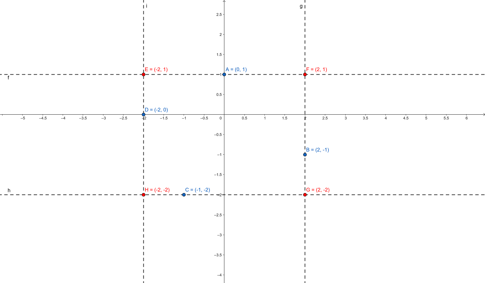
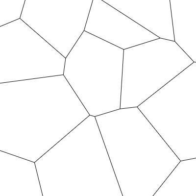

# Voronoi

Voronoi tessellation lib

## Installation

```sh
npm install @rgsoft/voronoi
```

## Usage

### Triangulation

The `triangulate` function generates a
[Delaunay triangulation](https://en.wikipedia.org/wiki/Delaunay_triangulation),
returning an array of `Triangle` instances.

```js
const { triangulate } = require('@rgsoft/voronoi');

const triangulation = triangulate(points, config);
```

The `points` parameter is an array of `Vector` (`@rgsoft/math` package),
containing the points for the triangles vertex. The `config` may have the
following properties:

- `rectBox` - an array of four `Vector` instances used as initial box for the triangulation
- `excludeRectVertex` - a boolean value that indicates whether the triangles generated with the initial box should be removed from the resulting triangulation (default `false`)

As a full example:

```js
const { triangulate } = require('@rgsoft/voronoi');

const points = [ new Vector(0.5 , 0.5) ];
const config = {
    rectBox: [
        new Vector(0, 1),
        new Vector(1, 1),
        new Vector(1, 0),
        new Vector(0, 0),
    ]
}

const triangulation = triangulate(points, config);
```

The `rectBox` points array is expected to be ordered in this fashion:
1. `TOP-LEFT`
2. `TOP-RIGHT`
3. `BOTTOM-RIGHT`
4. `BOTTOM-LEFT`

If `rectBox` is not provided, the box will be inferred using the `getRectBox`
function.

#### RectBox

The `getRectBox` receives an array of `Vector` instances, and returns another
array with the four points of the rectangular box that contains these points.
For example, if the provided points are `A`, `B`, `C`, and `D` (in any order),
the resulting box array would be `[E, F, G, H]` (in that order).



## Tessellation

The `tessellate` function draws the Voronoi tessellation on a `HTMLCanvasElement`.
It expects a `CanvasRenderingContext2d` and a triangulation (array of `Triangle`).

```js
const { triangulate } = require('@rgsoft/voronoi');

const points = [ new Vector(0.5 , 0.5) ];
const config = {
    rectBox: [
        new Vector(0, 1),
        new Vector(1, 1),
        new Vector(1, 0),
        new Vector(0, 0),
    ]
}

const triangulation = triangulate(points, config);
const canvasElement = document.getElementById('canvas1');
const context = canvasElement.getContext('2d');

tessellate(context, triangulation);
```


